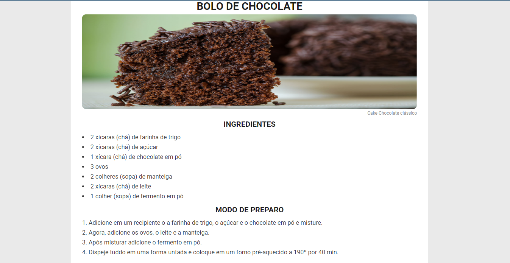

<h1 align="center"> Receita </h1>

Receita de bolo de chocolate.

  

## 🚀 Tecnologias

Esse projeto foi desenvolvido com as seguintes tecnologias:

- HTML e CSS
- Git e Github

## 💻 Projeto

O Projeto é uma página com uma receita de um bolo de chocolate.

- [Acesse o projeto finalizado, online](https://eullermoreiraa.github.io/Receita)

Feito com ♥ by Euller
